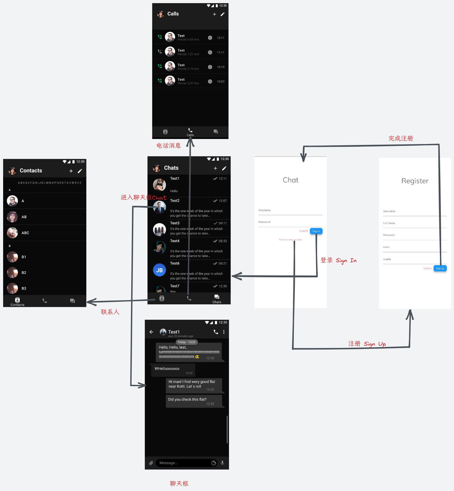
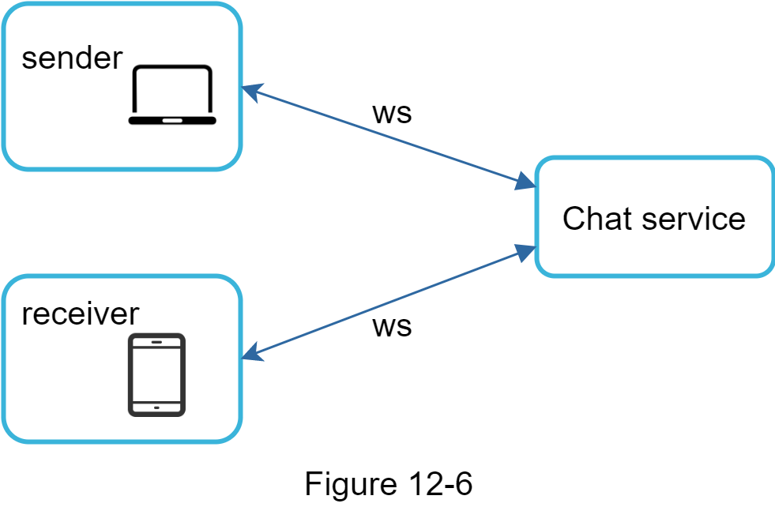

# 一、项目介绍 [杨海帆]

## 背景

即时通讯程序是现代移动设备上一个不可缺少的应用程序，且已经具有较为成熟的架构设计，和相当丰富的不同技术栈结合实现，也因此有比较丰富的参考资料。实现该项目过程学习的相关知识在未来其他项目中有比较普适的应用，因此方便知识和相关实现的迁移。即时通讯程序服务实时性，实现通讯功能，帮助使用者较为方便地联系传递信息。

## 项目需求分析

### 功能列表

- 具有低交付延迟的一对一聊天
- 小群聊天
- 在线状态
- 只支持消息
- 多设备支持。同一个账号可以同时登录多个账号。


## 计划和分工

- 原型设计
- 系统架构设计，技术选型
- Api设计
- 数据库设计
- 完成前端部分逻辑，完成项目基本结构，部分组件分离复用
- 完成后端环境部署
- 完成用户管理，鉴权相关api开发
- 一部分自动化测试
- webosocket api 开发
- openapi generator 前端完成部分接口调用
- 整体对接

# 二、界面原型设计 [杨海帆]

###整体界面设计

整体界面设计参考 **telegram** 安卓程序的界面设计，参考其统一的界面配色。跳转逻辑比较简单，同大多数包含用户管理的应用相同，注册按钮跳转注册界面，注册成功跳转回登录界面，登录成功进入主界面的首选项。


### 登录 注册


两页面由若干输入框与按钮组成。通过 **TextController** 来监听输入框，完成输入后将完整信息json编码，通过网络模块完成对api的http请求，并对返回信息进行判断，成功进行页面跳转，失败则显示相关错误信息。

### 主页


home主页屏幕由一个 **bottomAppBar** 底部导航栏组织联系三个页面，分别为联系人，电话消息，消息页面。三页面设计方式统一，主要为一个 ListView 列表组件，同时头像等组件可以分离进行复用。

### 聊天界面


底部栏为一个输入框和按钮，主要消息显示由两种组件置于一个动态的列表中，分别为自己发出的消息显示在右边，收到的消息显示在左边。同时消息组件是一个可变长伸缩的组件。


# 三、系统架构设计 [杨海帆]

这部分主要是对系统各部分的架构设计，和前面界面设计不同，这部分侧重于功能设计。

架构设计应按照从总体到局部、从粗到细的顺序分小节进行描述。

首先，描述系统的整体架构，包括前端、后端、API、数据库、消息队列等各个部分的大致结构，可用示意图来进行描述，并详细说明每部分的具体作用，以及为什么这么设计，其优缺点是什么。

然后，分小节分别介绍各个部分。比如前端包含什么模块，这些模块的关系如何，这些模块为什么这么设计，优缺点是什么。后端等也是如此。

最后，对每个模块给出实现的方案，比如采用什么框架、什么技术来实现。
## 客户端和服务器如何通信

在聊天系统中，客户端可以是移动应用程序或 Web 应用程序。 客户端之间不直接通信。 相反，每个客户端都连接到支持上述所有功能的聊天服务。 让我们专注于基本操作。 聊天服务必须支持以下功能：

- 接收来自其他客户端的消息。
- 为每条消息找到正确的收件人并将邮件转发给收件人。
- 如果收件人不在线，则将该收件人的消息保留在服务器上，直到在线。


​									
​    客户端（发送者和接收者）与聊天服务之间的关系。

    当客户端打算开始聊天时，它会使用一个或多个网络协议连接聊天服务。 对于聊天服务，网络协议的选择很重要。

## 发送端
  - 大多数客户端/服务器应用程序的请求由客户端发起。

  -  当发送者通过聊天服务向接收者发送消息时，它使用了久经考验的 **HTTP** 协议，这是最常见的 **Web** 协议。

  - 客户端打开与聊天服务的 HTTP 连接并发送消息，通知服务将消息发送给接收方。 keep-alive 对此非常有效，标头允许客户端保持与聊天服务的持久连接还减少了TCP握手的次数。 

## 接收端
由于 HTTP 是客户端发起的，因此从服务器发送消息并非易事。

多年来，许多技术用于模拟服务器发起的连接：轮询、长轮询和 WebSocket。

## WebSocket
- WebSocket 是从服务器向客户端发送异步更新的最常见解决方案。

  

- WebSocket 连接由客户端发起。 它是双向的和持久的。 它从 HTTP 连接开始，可以通过一些定义明确的握手“升级”到 WebSocket 连接。 通过这种持久连接，服务器可以向客户端发送更新。 即使有防火墙，WebSocket 连接通常也能正常工作。 这是因为它们使用 HTTP/HTTPS 连接也使用的端口 80 或 443。

- 在发送方，HTTP 是一个很好的协议，但由于 WebSocket 是双向的，所以没有理由不将它也用于发送。 

## WebSockets (ws) 如何用于发送方和接收方。


- 通过使用 WebSocket 进行发送和接收，它简化了设计并使客户端和服务器上的实现更加直接。 由于 WebSocket 连接是持久的，因此有效的连接管理在服务器端至关重要。

- WebSocket作为客户端和服务器之间的主要通信协议是为了进行双向通信，，其他一切都不一定是WebSocket。
- 聊天应用程序的大多数功能（注册、登录、用户配置文件等）都可以使用 HTTP 请求/响应方法。

## 无状态服务、有状态服务和第三方集成


    推送通知是最重要的第三方集成。 这是一种在新消息到达时通知用户的方式，即使应用程序没有运行也是如此。

## 储存
- 两种类型的数据。
  1. 通用数据，例如用户个人资料、设置、用户好友列表。 这些数据存储在健壮可靠的关系数据库中。
  2. 聊天历史数据。键值对存储。允许轻松的水平扩展。键值存储为访问数据提供了非常低的延迟。 

## 数据模型 


## 技术选型

### 前端

**Flutter**是 Google 的一个开源框架，用于从单个代码库构建漂亮的、本地编译的多平台应用程序。

#### 连接部分
- 使用 `openapi-generater` 生成接口请求对象, 手动调试
- dio 模块 异步请求接口
- web_socket_channel 建立 websocket 持久链接


### 后端
**Django** 是一个高级 Python Web 框架，它鼓励快速开发和简洁、实用的设计。

**Django REST framework**用于构建 Web API 的强大而灵活的工具包。 

#### 后端 技术路线 架构
- django-restfulframwork, channels, channels_redis

### 数据库
- 关系型数据库
  1. **MariaDB**是MySQL关系数据库管理系统的社区开发、商业支持分支。旨在 免费和开源软件 下 GNU 通用公共许可证 。MariaDB 旨在保持与 MySQL 的高度兼容性，确保具有库二进制奇偶校验和与 MySQL API 和命令的精确匹配的直接替换功能。
- NOSQL
  1. **MongoDB** 是一个 源代码可用 的跨平台 面向文档的数据库 程序。 被归类为NoSQL数据库程序，它使用JSON的文档模式 。 MongoDB根据 服务器端公共许可证 (SSPL) 获得许可。 

# 四、API设计 [杨海帆]

*Apifox* = Postman + Swagger + Mock + JMeter。集接口文档工具、接口Mock工具、接口自动化测试工具、接口调试工具于一体.

在RESTful架构中，每个网址代表一种资源（resource），所以网址中不能有动词，只能有名词，而且所用的名词往往与数据库的表格名对应。一般来说，数据库中的表都是同种记录的"集合"（collection），所以API中的名词也应该使用复数。

常用的HTTP动词Get, Post等对应对应名词的操作。

> - GET（SELECT）：从服务器取出资源（一项或多项）。
> - POST（CREATE）：在服务器新建一个资源。
> - PUT（UPDATE）：在服务器更新资源（客户端提供改变后的完整资源）。
> - PATCH（UPDATE）：在服务器更新资源（客户端提供改变的属性）。
> - DELETE（DELETE）：从服务器删除资源。

### 状态码（Status Codes）

服务器向用户返回的状态码和提示信息。

> 200 OK - [GET]：服务器成功返回用户请求的数据，该操作是幂等的（Idempotent）。
>
> 201 CREATED - [POST/PUT/PATCH]：用户新建或修改数据成功。
>
> 400 INVALID REQUEST - [POST/PUT/PATCH]：用户发出的请求有错误，服务器没有进行新建或修改数据的操作，该操作是幂等的。
>
> 401 Unauthorized - [*]：表示用户没有权限（令牌、用户名、密码错误）。*
>
> *403 Forbidden - [*] 表示用户得到授权（与401错误相对），但是访问是被禁止的。
>
> 404 NOT FOUND - [*]：用户发出的请求针对的是不存在的记录，服务器没有进行操作，该操作是幂等的。

## Register

API Docs for Register.

```POST /register/```

Register a new user to the system. 

```json
{
    "username": "username",
    "name": "name",
    "email": "email@user.com",
    "mobile": "9999999999",
    "password": "password"
}
```

- JSON Parameters

  **username** (*str*) – unique username 

  **name** (*str*) – name of the user

  **email** (*str*) – unique email of user 

  **mobile** (*str*) – unique mobile number of user 

  **password** (*str*) – password of user

- Status Codes

  [201 Created](http://www.w3.org/Protocols/rfc2616/rfc2616-sec10.html#sec10.2.2) – if supplied params are valid 

  [400 Bad Request](http://www.w3.org/Protocols/rfc2616/rfc2616-sec10.html#sec10.4.1) – if supplied params are invalid


## Login

API Docs for Login.

```POST /login/```

Login a user to the system. 

```json
{
    "username": "username",
    "password": "password",
}
```

- JSON Parameters 

  **username** (*str*) – unique username 

  **password** (*str*) – password of user 

 - Status Codes

    [200 OK](http://www.w3.org/Protocols/rfc2616/rfc2616-sec10.html#sec10.2.1) – if supplied params are valid

    [400 Bad Request](http://www.w3.org/Protocols/rfc2616/rfc2616-sec10.html#sec10.4.1) – if some fields are missing

    [401 Unauthorized](http://www.w3.org/Protocols/rfc2616/rfc2616-sec10.html#sec10.4.2) – if supplied params are invalid

## Account

API Docs for Account.

- GET /account/

  Get a user. 

  ```json
  { 
      "id": 1,
      "username": "username", 
      "name": "name",  
      "email": "email@test.com",  
      "mobile": "9999999999",  
      "is_superuser": true, 
      "is_staff": true
  }
  ```

  - Status Codes 

    [200 OK](http://www.w3.org/Protocols/rfc2616/rfc2616-sec10.html#sec10.2.1) – if request is authenticated

    [401 Unauthorized](http://www.w3.org/Protocols/rfc2616/rfc2616-sec10.html#sec10.4.2) – if request is not authenticated

- PUT /account/

  Update all details of user. 

  ```json
  {   
      "username": "username",   
      "name": "uname", 
      "email": "email@test.com",  
      "mobile": "9999999999",  
      "password": "password" 
  } 
  ```

  - JSON Parameters 

    **username** (*str*) – unique username 

    **name** (*str*) – name of the user 

    **email** (*str*) – unique email of user 

    **mobile** (*str*) – unique mobile number of user

     **password** (*str*) – password of user

  - Status Codes
  -  [200 OK](http://www.w3.org/Protocols/rfc2616/rfc2616-sec10.html#sec10.2.1) – if request is authenticated
  -  [400 Bad Request](http://www.w3.org/Protocols/rfc2616/rfc2616-sec10.html#sec10.4.1) – if any param is not supplied
  -  [401 Unauthorized](http://www.w3.org/Protocols/rfc2616/rfc2616-sec10.html#sec10.4.2) – if request is not authenticated

## Websocket接口

`ws/chat/<room_name>`

建立websocket持久链接

# 五、数据库设计 [杨海帆]

1. 通用数据，例如用户个人资料、设置、用户好友列表。 这些数据存储在健壮可靠的关系数据库中。因此采用mariadb 关系型数据库。
2. 聊天历史数据。键值对存储。允许轻松的水平扩展。键值存储为访问数据提供了非常低的延迟。 因此采用 redis作为通道层数据库


### User

| Name           | Type        |
| -------------- | ----------- |
| Username       | varchar(30) |
| Password       | varchar(30) |
| Email          | varchar(80) |
| Name           | varchar(25) |
| ProfilePicture | text        |

主键为 **Username**

### Messages

| Name       | Type        |
| ---------- | ----------- |
| id         | integer     |
| user_id    | varchar(30) |
| message_id | integer     |

主键为 **id**, 外键为 **user_id**, **message_id**.

### requestfriendship

| Name        | Type        |
| ----------- | ----------- |
| id          | integer     |
| Receiver_id | varchar(30) |
| Sender_id   | varchar(30) |

主键为 **id**, 外键为 **Receiver_id**, **Sender_id**.

### message

| Name             | Type          |
| ---------------- | ------------- |
| id               | integer       |
| IdentifierNumber | integer       |
| Content          | varchar(2048) |
| Type             | varchar(5)    |
| Receiver_id      | varchar(30)   |
| Sender_id        | varchar(30)   |
| Date             | datetime      |

主键为 **id**, 外键为 **Sender_id**, **Receiver_id**.

### friendship

| Name       | Type        |
| ---------- | ----------- |
| id         | integer     |
| Person1_id | varchar(30) |
| Person2_id | varchar(30) |

主键为 **id**, 外键为 **Person1_id**, **Person2_id**.

### 数据库相关技术

通过 `django-rest-framework` 中创建相对应的数据模型，再经过序列化，最后执行相关数据库操作保存在数据库中。

# 六、Flutter前端的实现 [杨海帆]

前端的具体实现

## 6.1 用户管理的实现

这部分是用户管理模块，如登录、注册、修改等功能的具体实现。

将设计好的api导出为openapi.json格式，通过openapi-generator来生成相对应可用于调用的前端接口库，因为该库会依据设计好的openapi.json, 创建相对应的用于前端的模型(model), 因此实现前端调用接口的时候就不需要自己编写对应的model，只需要根据情况对生成的model按需修改，最后在使用时创建Openapi()的对象进行使用。

在对应需要调用接口的页面的组件中添加对应的异步函数，例如登录页面中，


### 登录 注册


两页面由若干输入框与按钮组成。通过 **TextController** 来监听输入框，完成输入后将完整信息json编码，通过网络模块完成对api的http请求，并对返回信息进行判断，成功进行页面跳转，失败则显示相关错误信息。

屏幕组件为状态组件，当后端api处理完成http请求后，将会返回对应信息与状态码，当状态码为错误状态，需要将对应信息填入相对应的组件，然后通过setState()方法更新组件中变量，来刷新组件。

当按下 **Cancel** 按钮，对每个 TextController 执行清空操作。

### 主界面


home主页屏幕由一个 **bottomAppBar** 底部导航栏组织联系四个页面，分别为Messages，Notifications，Calls, Contacts。四页面设计方式统一，主要为一个 ListView 列表组件，同时头像等组件可以分离进行复用。

homeScreen是一个状态页面，通过一个 **ValueNotifier** 来监听底部状态栏选择值的变化，通过setState来选择页面的Index值，最后加载相对应页面。

### 聊天界面


底部栏为一个输入框和按钮，主要消息显示由两种组件置于一个动态的列表中，分别为自己发出的消息显示在右边，收到的消息显示在左边。同时消息组件是一个可变长伸缩的组件。重点是当websocket channel接收到信息时要响应判别消息的对象，进行相对应的组件绘制。

## 6.2 聊天功能的实现


- WebSocket 连接由客户端发起。 双向的和持久。 它从 HTTP 连接开始，可以通过一些定义明确的握手“升级”到 WebSocket 连接。 通过这种持久连接，服务器可以向客户端发送更新。 即使有防火墙，WebSocket 连接通常也能正常工作。 这是因为它们使用 HTTP/HTTPS 连接也使用的端口 80 或 443。


- 通过使用 WebSocket 进行发送和接收，它简化了设计并使客户端和服务器上的实现更加直接。


# 七、后端的实现[杨海帆]

这部分也是分模块来展示后端的实现方案。具体参见前面第六部分。

# 八、系统测试

## 8.1 单元测试

这部分是单元测试的方案，可以列表统计有多少测试，覆盖率是多少。

## 8.2 集成测试

## 8.3 测试部署及结果

前端自动部署使用了 `actions/setup-java@v2`, `subosito/flutter-action@v2`分别安装完成java, 与 flutter 环境. 在仓库中配置密钥授予actions对仓库操作的权限。

```yaml
      - uses: actions/checkout@v3
      - uses: actions/setup-java@v2
        with:
          distribution: 'zulu'
          java-version: '11'
      - uses: subosito/flutter-action@v2
        with:
          flutter-version: '2.10.4'
      - run: flutter pub get
      - run: flutter build apk --release
      - uses: ncipollo/release-action@v1
        with:
         artifacts: "build/app/outputs/flutter-apk/*.apk"
         token: ${{ secrets.GITHUB_TOKEN }}
```

后端完成安装对应依赖库，使用django自带的测试方法对编写的测试用例进行执行。

```yaml
      - uses: actions/checkout@v2
      - name: Set up Python ${{ matrix.python-version }}
        uses: actions/setup-python@v2
        with:
          python-version: ${{ matrix.python-version }}
      - name: Install Dependencies
        run: |
          python -m pip install --upgrade pip
          pip install -r requirements.txt
      - name: Run Tests
        run: |
          python manage.py migrate
          python manage.py test drf_user.test
```


通过 github actions 容器进行自动化部署，前端根据tag, 自动release生成可发布安装的apk文件。


# 九、系统部署 [杨海帆]

后端系统采用云服务器部署的方式
1. 创建 `Python` 虚拟环境并生效

```shell
python3 -m venv myvenv
source myvenv/bin/activate
```

2. 安装必要库

```shell
python3 -m pip install -r requirements.txt
```

3. 启用通道层

通道层是一种通信系统。它允许多个消费者实例相互交谈.

每个消费者实例都有一个自动生成的唯一通道名称，所以可以通过通道层进行通信。

```shell
docker run -p 6379:6379 -d redis:latest
```

4. 启用数据库建立链接

根据个人设置修改数据库帐号密码, `backend/backend/settings.py`
```json
DATABASES = {
    'default': {
        'ENGINE': 'django.db.backends.mysql',
        'NAME': 'chat',
        'USER': 'test',
        'PASSWORD': '123456',
        'OPTIONS': {
        }
    }
}
```

# 十、功能展示 [杨海帆]

<video><source src="功能展示.mkv" type="video/mp4"</video>

# 十一、清单 [杨海帆]

- 前端代码: [frontend](https://github.com/mobile-develop-practice/frontend)
- 后端代码: [backend](https://github.com/mobile-develop-practice/backend)
- 原型设计文件: [doc/原型设计目录](https://github.com/mobile-develop-practice/doc/tree/main/%E5%8E%9F%E5%9E%8B%E8%AE%BE%E8%AE%A1)
- 项目演示视频: [doc/功能展示](https://github.com/mobile-develop-practice/doc/blob/main/%E5%8A%9F%E8%83%BD%E5%B1%95%E7%A4%BA.mkv)
- api 设计文件: [doc/mdp_api.html](https://github.com/mobile-develop-practice/doc/blob/main/mdp_api.html)

# 十二、总结 [杨海帆]

与预期设想难度很大，数据库与模型的设计完全设计完备和实现， 接口没有全部完成。前端状态组件的使用还有许多不了解，导致实现程序与预期差距很大。

# 十二、参考文献 [杨海帆]

系统所参考的文献或者代码，比如：

- Django: https://docs.djangoproject.com/en/4.0/
- Django-restframework: https://www.django-rest-framework.org/
- Django-channels, Django-channels-redis: https://channels.readthedocs.io/en/stable/
- drf_user: https://drf-user.readthedocs.io/en/latest/
- flutter: https://flutter.dev/
- web_socket_channel: https://pub.dev/packages/web_socket_channel
- openapi-generator: https://github.com/OpenAPITools/openapi-generator
